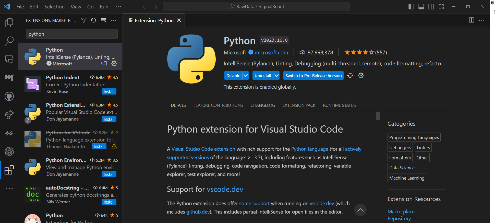
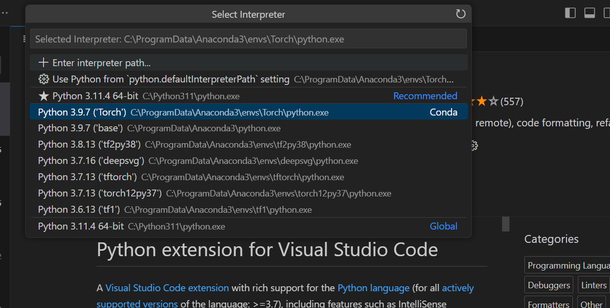

# Introduction to Installing Anaconda and VS Code for AI Work

If you're new to AI and machine learning, you may be wondering where to start. Establishing your development environment and starting your AI journey is simple with the right tools and guidance. In this blog post, we'll install Anaconda and VS Code, creating environments, and installing packages, everything you need to start AI work.

## Anaconda

Anaconda is a popular open-source distribution of the Python and R programming languages used for data science and machine learning tasks. It comes with many pre-installed packages and a user-friendly interface, making it an excellent choice for beginners.

To install Anaconda, you can follow these steps:

1. Visit the official Anaconda website at [https://www.anaconda.com/](https://www.anaconda.com/) and navigate to the "Download" the appropriate version
2. Run the installer, and make sure to select the option to add Anaconda to your system's PATH variable during the installation process.

Anaconda provides a friendly interface for environment management. Environments allow you to isolate different sets of packages and dependencies, making it easier to manage and switch between projects. The default environment is called “base”. It is highly recommended that creating environments for big projects to avoid package version problems.

## Visual Studio Code (VS Code)

Popular integrated development environment (IDE) for Python programming include Spyder (open-source), PyCharm (JetBrains) and VS Code (Microsoft). I prefer using VS Code for its flexibility and the wide range of extensions available.

To install VS Code, follow these steps:

1. Go to the official VS Code website at [https://code.visualstudio.com/](https://code.visualstudio.com/).
2. Download the installer for your operating system, run it and complete the installation process.
3. Once you have installed VS Code, you can enhance your coding experience by installing relevant extensions. Some popular extensions for AI work include Python, Jupyter, and Git.

1. Press Ctrl+P or F1 (windows) to open the search box, and then type "> select interpreter". A page will pop up, and then click on "Python: Select Interpreter". Here are all the environments you have created with Python. 

## Creating Environments and Installing Packages

After installing Anaconda and VS Code, you're ready to create your first environment and start installing packages for your AI work. 

To create an environment and install packages, there are 2 Choices:

1. Through Anaconda Navigator:
    1. Click on the "Environments" tab.
    2. Click on the "Create" button to create a new environment. Give it a meaningful name, such as "AI_Work".
    3. Select the desired Python version for your environment.
    4. Search other required packages on the top right search box.
2. Through `conda` command
    1. In the terminal, you can use the `conda` command to install packages. 
    2. Activate your environment before working on a project by running the command `conda activate AI_Work` in the terminal.
    3. To install the popular machine learning library scikit-learn, for example, you can run `conda install scikit-learn`.

## Conclusion

In this blog post, we have introduced you to the process of installing Anaconda and Visual Studio Code, creating environments, and installing packages - the essential steps to get started with AI work. By following these instructions, even if you have no prior experience in machine learning, you can set up your environment and begin your journey into the exciting field of AI. Happy coding!